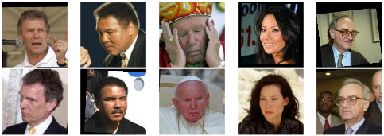

# Face Identification

Metric Learning Approaches for Face Identification
# File structure and modules

## Getting started

#### Clone this repository
```sh
$ git clone https://github.com/debtanu177/face_identification.git
```
#### Install
```
opencv
sklearn
numpy
tqdm
```

#### Run
First step(Optional):
```sh
$ python3 dataselect.py
```

Second step:
```sh
$ python3 main.py
```
### Examples of positive pairs correctly classified using the MkNN classifier with LMNN as a base metric


# References
Is that you? Metric Learning Approaches for Face Identification
Matthieu Guillaumin, Jakob Verbeek and Cordelia Schmid http://lear.inrialpes.fr/pubs/2009/GVS09/verbeek09iccv2.pdf
